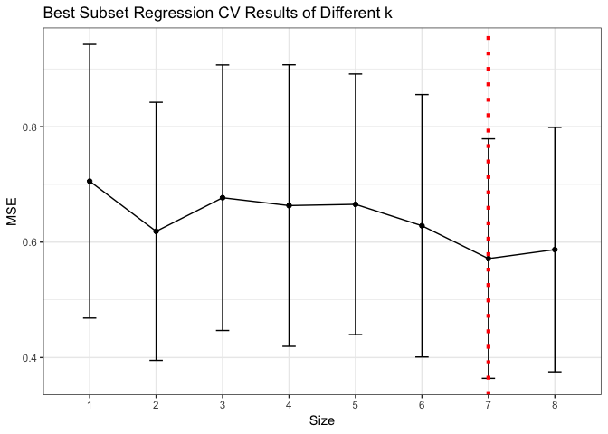

1. Let X denote an n × p matrix with each row an input vector and y denote an n-dimensional vector of the output in the training set. For fixed *q* ≥ 1, define
===============================================================================================================================================================

$$
Bridge\_{\\lambda}(\\beta) = (y - X\\beta)^T(y - X\\beta) + \\lambda\\sum\_{j=1}^{p}|\\beta\_{j}|^q
$$

for *λ* &gt; 0. Denote the minimal value of the penalty function over the least squares solution set by
=======================================================================================================

$$
\\displaystyle t\_{0} = min\_{\\beta:X^T X\\beta=X^T y} \\sum\_{j=1}^{p}|\\beta\_{j}|^q
$$

(a) Show that *B**r**i**d**g**e**λ*(*β*) for *λ* &gt; 0 is a convex function in *β*, which is strictly convex for q &gt; 1.
--------------------------------------------------------------------------------------------------------------------------------------

Denote *R**S**S* = (*y* − *X**β*)*T*(*y* − *X**β*), we then
calculate its second derivative:

$$
\\begin{split}
\\frac{\\partial^2Bridge\_{\\lambda}(\\beta)}{\\partial \\beta^2}
&= \\frac{\\partial^2 RSS}{\\partial \\beta^2} + \\frac{\\partial^2 \\lambda\\sum\_{j=1}^{p}|\\beta\_{j}|^q}{\\partial \\beta^2} \\\\ \\\\
\\frac{\\partial RSS}{\\partial \\beta}
&= -2X^T(y - X\\beta) \\\\
\\frac{\\partial^2 RSS}{\\partial \\beta^2}
&= 2X^TX \\\\
\\frac{\\partial \\lambda\\sum\_{j=1}^{p}|\\beta\_{j}|^q}{\\partial \\beta\_{j}}
&= \\lambda q |\\beta\_{j}|^{q-1} sign(\\beta\_{j}) \\\\
\\frac{\\partial^2 \\lambda\\sum\_{j=1}^{p}|\\beta\_{j}|^q}{\\partial \\beta\_{j}^2}
&= sign(\\beta\_{j})^2 \\lambda q (q-1) |\\beta\_{j}|^{q-2}  \\\\
&= \\lambda q (q-1) |\\beta\_{j}|^{q-2}  \\\\
\\end{split}
$$

-   *X**T**X* is postive semi-definite matrix

-   *λ**q*(*q* − 1)|*β**j*|*q* − 2 ≥ 0 for
    *q* ≥ 1, *λ* &gt; 0

-   *λ**q*(*q* − 1)|*β**j*|*q* − 2 &gt; 0 for
    *q* &gt; 1

So *B**r**i**d**g**e**λ*(*β*) for *λ* &gt; 0 is a convex
function in *β*, which is strictly convex for q &gt; 1.

(b) Show that for q &gt; 1 there is a unique minimizer, $\\hat{\\beta}(\\lambda)$, with $\\sum\_{j=1}^{p}|\\hat{\\beta\_{j}}(\\lambda)|^q \\leq t\_{0}$
-------------------------------------------------------------------------------------------------------------------------------------------------------

*B**r**i**d**g**e**λ*(*β*) is a convex function, if there
exist unique minimizer $\\hat{\\beta}$, then
$\\frac{\\partial RSS}{\\partial \\hat{\\beta}} = 0$

Denote
$S\_{j}(\\beta, X, y) = \\frac{\\partial RSS}{\\partial \\beta\_{j}}$
and
*d*(*γ*, *λ*, *β*)=*λ**q*|*β**j*|*q* − 1*s**i**g**n*(*β**j*),
solving the above equation equals to solve
*S**j*(*β*, *X*, *y*)= − *d*(*q*, *λ*, *β**j*) for
*j* = 1, 2, ..., *p*.

Rewrite *β* as (*β**j*, *β*−*j*), where
*β*−*j* is a (p-1) vector consisting of the
*β**i*′*s* other than *β**j*. Then we got:

$$
\\begin{split}
S\_{j}(\\beta\_{j}, \\beta^{-j}, X, y) &= -d(q, \\lambda, \\beta\_{j}) \\\\
S\_{j}(\\beta\_{j}, \\beta^{-j}, X, y) &= \\frac{\\partial (y - X\\beta)^T(y - X\\beta)}{\\partial \\beta\_{j}} \\\\
& = \\frac{\\partial (y - \\sum\_{i=1}^{p}x\_{i}\\beta\_{i})^T(y - \\sum\_{i=1}^{p}x\_{i}\\beta\_{i})}{\\partial \\beta\_{j \\in (1,2,...,p)}} \\\\
& = 2x\_{j}^Tx\_{j}\\beta\_{j} + 2\\sum\_{i \\neq j}x\_{j}^Tx\_{i}\\beta\_{i} - 2x\_{j}^Ty \\\\
-d(q, \\lambda, \\beta\_{j}) &= \\lambda q |\\beta\_{j}|^{q-1} sign(\\beta\_{j})
\\end{split}
$$

We can tell from above that:

-   *S**j*(*β**j*, *β*−*j*, *X*, *y*)
    is linear function of *β**j*, with positive slope
    2*x**j**T**x**j*

-   from answer for (a) we know that, −*d*(*q*, *λ*, *β**j*)
    is a nonlinear function of *β**j* and continuous,
    differentiable and monotonically decreasering for q &gt; 1, except
    at *β**j* = 0 for 1 &lt; *q* &lt; 2

So the equation above will have a unique solution.

(c)
---

(d)
---

2. We perform best subset, forward stepwise, and backward stepwise selection on a single data set. For each approach, we obtain p + 1 models, containing 0, 1, 2, . . . , p predictors. Explain your answers:
=============================================================================================================================================================================================================

(a) Which of the three models with k predictors has the smallest training RSS?
------------------------------------------------------------------------------

Best subset selection has the smallest training RSS. Because forward and
backward selection results depend heavily on the path they choose.

(b) Which of the three models with k predictors has the smallest test RSS?
--------------------------------------------------------------------------

It varies by chance, the smallest test RSS could happened to any of
them, most likely to be best subset selection though.

(c) True or False:
------------------

### (i) The predictors in the k variable model identified by forward stepwise are a subset of the predictors in the (k+1) variable model identified by forward stepwise selection.

True.

### (ii) The predictors in the k-variable model identified by backward stepwise are a subset of the predictors in the (k+1) variable model identified by backward stepwise selection.

True

### (iii) The predictors in the k variable model identified by backward stepwise are a subset of the predictors in the (k+1) variable model identified by forward stepwise selection.

False

### (iv) The predictors in the k variable model identified by forward stepwise are a subset of the predictors in the (k+1) variable model identified by backward stepwise selection.

False

### (v) The predictors in the k variable model identified by best subset are a subset of the predictors in the (k+1) variable model identified by best subset selection.

False

3. Derive the entries in Table 3.4, the explicit forms for estimators in the orthogonal case.
=============================================================================================

The OLS estimator of *β* is $\\hat{\\beta}^{ols} = (X^T X)^{-1}X^T y$,
and since X columns are orthonormal, *X**T**X* = *I*, so
$\\hat{\\beta}^{ols} = X^T y$.

a) for best subset
------------------

Extend *X**n* × *p* to ℝ*n* × *N*, we add N - p
linearly independent additional orthonormal vectors $\\tilde{x}\_{j}$
with corresponding *γ**j* coefficients to the end, then y can
write as:

$$
y = \\sum\_{j=1}^p \\hat{\\beta\_{j}}^{ols}x\_{j} + \\sum\_{j=p+1}^N \\gamma\_{j}\\tilde{x}\_{j}
$$

If we seek to approximate y with a subset of size M, then
$\\hat{y} = \\sum\_{j=1}^p I\_{j}\\hat{\\beta\_{j}}^{ols}x\_{j}$, with
*I**j* = 1 indicates *x**j* in the subset, and
zero otherwise. Then

$$
\\begin{split}
RSS &= ||y - \\hat{y}||\_2^2 \\\\
&= ||\\sum\_{j=1}^p \\hat{\\beta\_{j}}^{ols}x\_{j} + \\sum\_{j=p+1}^N \\gamma\_{j}\\tilde{x}\_{j} - \\sum\_{j=1}^p I\_{j}\\hat{\\beta\_{j}}^{ols}x\_{j}||\_2^2 \\\\
&= ||\\sum\_{j=1}^p (1 - I\_{j})\\hat{\\beta\_{j}}^{ols}x\_{j} + \\sum\_{j=p+1}^N \\gamma\_{j}\\tilde{x}\_{j}||\_2^2 \\\\
&= \\sum\_{j=1}^p (1 - I\_{j})^2\\hat{\\beta\_{j}^2}^{ols} ||x\_{j}||\_2^2 + \\sum\_{j=p+1}^N \\gamma\_{j}^2||\\tilde{x}\_{j}||\_2^2 \\\\
&= \\sum\_{j=1}^p (1 - I\_{j})^2\\hat{\\beta\_{j}^2}^{ols} + \\sum\_{j=p+1}^N \\gamma\_{j}^2 \\\\
\\end{split}
$$

Now we rank all the $\\hat{\\beta\_{j}}^{ols}$ by their absolute value
$(|\\hat{\\beta\_{\[1\]}}^{ols}| \\geq |\\hat{\\beta\_{\[2\]}}^{ols}| \\geq ... \\geq |\\hat{\\beta}\_{\[M\]}^{ols}| \\geq |\\hat{\\beta}\_{\[M+1\]}^{ols}| \\geq ... \\geq |\\hat{\\beta}\_{\[p\]}^{ols}|)$,
then

$$
\\begin{split}
RSS &= \\sum\_{j=\[1\]}^{\[M\]} (1 - I\_{j})^2\\hat{\\beta\_{j}^2}^{ols} + \\sum\_{j=\[M+1\]}^{\[p\]} (1 - I\_{j})^2\\hat{\\beta\_{j}^2}^{ols} + \\sum\_{j=p+1}^N \\gamma\_{j}^2 \\\\
min\\{RSS\\} &= \\sum\_{j=\[M+1\]}^{\[p\]} (1 - I\_{j})^2\\hat{\\beta\_{j}^2}^{ols} + \\sum\_{j=p+1}^N \\gamma\_{j}^2 \\\\
with: \\\\
\\hat{\\beta\_{j}}^{best-subset} &= arg min\_{\\hat{\\beta}^{ols}, I} RSS \\\\
&= \\hat{\\beta\_{j}}^{ols} \\cdot I(|\\hat{\\beta\_{j}}^{ols}| \\geq |\\hat{\\beta}\_{\[M\]}^{ols}|)
\\end{split}
$$

b) for ridge regression
-----------------------

From previous conclusion, we can derive

$$
\\begin{split}
\\hat{\\beta}^{ridge} &= (X^T X + \\lambda I)^{-1}X^T y \\\\
&= (I+ \\lambda I)^{-1}X^T y \\\\
&= \\frac{X^T y}{1+\\lambda} \\\\
&= \\hat{\\beta}^{ols} / (1+\\lambda) \\\\
\\end{split}
$$

c) for LASSO
------------

*L*(*β*)=||*y* − *X**β*||22 + *λ*||*β*||1,
here we set the objective function as
$F(\\beta) = \\frac{1}{2}||y - X\\beta||\_2^2 + \\lambda||\\beta||\_1$,
then

$$
\\begin{split}
F(\\beta) 
&= \\frac{1}{2}y^T y - y^TX\\beta + \\frac{1}{2}\\beta^T\\beta + \\lambda||\\beta||\_1 \\\\
&= const. - y^TX\\beta + \\frac{1}{2}||\\beta||^2 + \\lambda||\\beta||\_1 \\\\
&= const. - (\\hat{\\beta}^{ols})^T\\beta + \\frac{1}{2}||\\beta||^2 + \\lambda||\\beta||\_1 \\\\
\\end{split}
$$

After remove the constant and consider each *β**j*
individually, we get
$f(\\beta\_{j}) = -\\hat{\\beta\_{j}}^{ols}\\beta\_{j} + \\frac{1}{2}\\beta\_{j}^2 + \\lambda|\\beta\_{j}|$
and we need to minimize it. Then we need
$f'(\\beta\_{j}) = -\\hat{\\beta\_{j}}^{ols} + \\beta\_{j} + \\lambda\\cdot sign(\\beta\_{j}) = 0$

Here we consider 6 cases:

-   *β**j* &lt; 0 and $\\hat{\\beta\_{j}}^{ols} &gt; 0$, then
    *f*′(*β**j*) will always &lt; 0, there is no minimum

-   *β**j* ≥ 0 and
    $\\lambda &gt; \\hat{\\beta\_{j}}^{ols} &gt; 0$, then
    *f*′(*β**j*) will always &gt; 0, there is no minimum

-   *β**j* ≥ 0 and $\\hat{\\beta\_{j}}^{ols} \\geq \\lambda$,
    then we get
    $argmin\_{\\beta\_{j}}f'(\\beta\_{j}) = \\hat{\\beta\_{j}}^{ols} - \\lambda$

-   *β**j* &gt; 0 and $\\hat{\\beta\_{j}}^{ols} &lt; 0$, then
    *f*′(*β**j*) will always &gt; 0, there is no minimum

-   *β**j* ≤ 0 and
    $-\\lambda &lt; \\hat{\\beta\_{j}}^{ols} &lt; 0$, then
    *f*′(*β**j*) will always &lt; 0, there is no minimum

-   *β**j* ≤ 0 and
    $\\hat{\\beta\_{j}}^{ols} \\leq -\\lambda$, then we get
    $argmin\_{\\beta\_{j}}f'(\\beta\_{j}) = \\hat{\\beta\_{j}}^{ols} + \\lambda$

Whenever there is no minimum, we discard the covariate, which means
shrink the *β**j* = 0. So combine all those situations,
$\\hat{\\beta}\_{j}^{lasso} = sign(\\hat{\\beta\_{j}}^{ols})(|\\hat{\\beta\_{j}}^{ols}| - \\lambda)\_+$

4. The prostate data described in Chapter 3 of \[ESL\] have been divided into a training set of size 67 and a test set of size 30. Carry out the following analyses on the training set. For each analysis, compute and plot the cross-validation or BIC estimates of the prediction error as the model complexity increases as in Figure 3.7. Report the final estimated model as well as the test error and its standard error over the test set as in Table 3.3. Briefly discuss your results.
=================================================================================================================================================================================================================================================================================================================================================================================================================================================================================================

(a) Best-subset linear regression with k chosen by 5-fold cross-validation.
---------------------------------------------------------------------------

Based on CV results, the best subset size is 7, then we use the whole
training data to build the model and then test on test data, we get the
test.error = 0.5165135.

(b) Best-subset linear regression with k chosen by BIC.
-------------------------------------------------------

Based on BIC results, the best subset size is 2, then we use the whole
training data to build the model and then test on test data, we get the
test.error = 0.4924823.

(c) Lasso regression with *λ* chosen by 5-fold cross-validation.
----------------------------------------------------------------

Based on CV results, the best *λ* = 0.0083893, then we use the whole
training data to build the model and then test on test data, we get the
test.error = 0.4731328.

(d) Lasso regression with *λ* chosen by BIC.
--------------------------------------------

Based on BIC results, the best *λ* = 0.004965, then we use the whole
training data to build the model and then test on test data, we get the
test.error = 0.5073711.

(e) Principle component regression with q chosen by 5-fold cross-validation.
----------------------------------------------------------------------------

Based on PCR results and scoreplot, the best *q* = 3, then we use the
whole training data to build the model and then test on test data, we
get the test.error = 0.4862875.

conclusion for (a) ~ (e)
------------------------

-   BS\_CV: Best-subset linear regression with k chosen by 5-fold
    cross-validation

-   BS\_BIC: Best-subset linear regression with k chosen by BIC

-   LASSO\_CV: Lasso regression with *λ* chosen by 5-fold
    cross-validation

-   LASSO\_BIC: Lasso regression with *λ* chosen by BIC

-   PCR\_CV: Principle component regression with q chosen by 5-fold
    cross-validation

Appendix
--------

    knitr::opts_chunk$set(echo = FALSE, message = FALSE, warning = FALSE, comment = "")
    library(tidyverse)
    library(leaps) # for best subset selection
    library(glmnet) # for lasso
    # library(devtools)
    # install_github("gabrielrvsc/HDeconometrics")
    library(HDeconometrics) # for ic.glmnet
    library(pls) # for cv.pcr
    options(knitr.table.format = "latex")
    theme_set(theme_bw())
    set.seed(99)

    # load data and standardize it
    prostate_train = read.table("prostate_cancer.dat", header = T) %>% 
      mutate(lcavol = (lcavol - mean(lcavol)) / sd(lcavol),
             lweight = (lweight - mean(lweight)) / sd(lweight),
             age = (age - mean(age)) / sd(age),
             lbph = (lbph - mean(lbph)) / sd(lbph),
             svi = (svi - mean(svi)) / sd(svi),
             lcp = (lcp - mean(lcp)) / sd(lcp),
             gleason = (gleason - mean(gleason)) / sd(gleason),
             pgg45 = (pgg45 - mean(pgg45)) / sd(pgg45),
             svi = as.factor(svi), 
             train = as.factor(train)) %>% 
      filter(train == "TRUE") %>% 
      select(-train) %>% 
      as.tibble()

    prostate_test = read.table("prostate_cancer.dat", header = T) %>% 
      mutate(lcavol = (lcavol - mean(lcavol)) / sd(lcavol),
             lweight = (lweight - mean(lweight)) / sd(lweight),
             age = (age - mean(age)) / sd(age),
             lbph = (lbph - mean(lbph)) / sd(lbph),
             svi = (svi - mean(svi)) / sd(svi),
             lcp = (lcp - mean(lcp)) / sd(lcp),
             gleason = (gleason - mean(gleason)) / sd(gleason),
             pgg45 = (pgg45 - mean(pgg45)) / sd(pgg45),
             svi = as.factor(svi), 
             train = as.factor(train)) %>% 
      filter(train == "FALSE") %>% 
      select(-train) %>% 
      as.tibble()

    # best subset and choose k by CV
    K = 5
    n = 100

    predict_regsubsets = function (object ,newdata ,id ,...){
            form=as.formula(object$call [[2]])
            mat=model.matrix(form,newdata)
            coefi=coef(object ,id=id)
            xvars=names(coefi)
            mat[,xvars]%*%coefi
    }

    cv.bs.errors = matrix(nrow = n, ncol = 8)
    for (j in 1:n) {
      cv_dat_index = sample(1:nrow(prostate_train), nrow(prostate_train) * 0.8, replace = F)
      best.fit = regsubsets(lpsa ~ ., data = prostate_train[cv_dat_index, ], nvmax = 8) 
      for (i in 1:8) {
        pred = predict_regsubsets(best.fit, prostate_train[-cv_dat_index, ], id = i) 
        cv.bs.errors[j,i] = mean((prostate_train$lpsa[-cv_dat_index] - pred)^2)
        }
    }
    cv.bs.frame = tibble(cv.mean = apply(cv.bs.errors, 2, mean), 
                      cv.sd = apply(cv.bs.errors, 2, sd), 
                      size = c(1:8))
      
    p.cv.bs <- ggplot(cv.bs.frame, aes(x = size, y = cv.mean)) + 
      geom_line() + geom_point() + 
      geom_errorbar(aes(ymin = cv.mean - cv.sd, ymax = cv.mean + cv.sd), 
                    width = .2, position = position_dodge(0.05)) +
      labs(title = "Best Subset Regression CV Results of Different k", y = "MSE", x = "Size") + 
      scale_x_discrete(limits = c(1:8)) +
      geom_vline(xintercept = 7, linetype = "dotted", 
                    color = "red", size = 1.5)
    p.cv.bs

    # full training data for building model and test
    bestfit.bs.cv = regsubsets(lpsa ~ ., data = prostate_train, nvmax = 8)
    pred.bs.cv = predict_regsubsets(bestfit.bs.cv, prostate_test, id = 7) 
    test_error.bs.cv = mean((prostate_test$lpsa - pred.bs.cv) ^ 2)

    # best subset and choose k by BIC
    bic.bs.frame = tibble(size = c(1:8),
                          BIC.value = summary(bestfit.bs.cv)$bic)

    p.bic.bs = ggplot(bic.bs.frame, aes(x = size, y = BIC.value)) + 
      geom_line() + geom_point() + 
      labs(title = "Best Subset Regression BIC Results of Different k", y = "BIC", x = "Size") + 
      scale_x_discrete(limits = c(1:8)) +
      geom_vline(xintercept = 2, linetype = "dotted", 
                    color = "red", size = 1.5)
    p.bic.bs
    pred.bs.bic = predict_regsubsets(bestfit.bs.cv, prostate_test, id = 2) 
    test_error.bs.bic = mean((prostate_test$lpsa - pred.bs.bic) ^ 2)

    # lasso and choose lambda by cv
    bestfit.lasso.cv = cv.glmnet(data.matrix(prostate_train[,-ncol(prostate_train)]),
                                 data.matrix(prostate_train[,ncol(prostate_train)]), 
                                 family = "gaussian", alpha = 1, type.measure = "mse")
    pred.lasso.cv = predict.cv.glmnet(bestfit.lasso.cv, 
                                      data.matrix(prostate_test[,-ncol(prostate_test)]), 
                                      lambda = bestfit.lasso.cv$lambda.min)
    test_error.lasso.cv = mean((prostate_test$lpsa - pred.lasso.cv) ^ 2)

    plot(bestfit.lasso.cv)

    # lasso and choose lambda by BIC
    K = 5
    n = 100

    lambda.seq = seq(from = 0.0000001, to = 0.01, length.out = 1000)

    bic.lasso.errors = rep(0, length(lambda.seq))
    for (i in 1:length(lambda.seq)) {
      best.fit = ic.glmnet(data.matrix(prostate_train[,-ncol(prostate_train)]),
                          data.matrix(prostate_train[,ncol(prostate_train)]), 
                          crit = "bic", family = "gaussian", alpha = 1, lambda = lambda.seq[i])
      bic.lasso.errors[i] = as.numeric(best.fit$ic[1])
    }

    bic.lasso.frame = tibble(lambda = lambda.seq,
                             BIC.value = bic.lasso.errors)

    p.bic.lasso = ggplot(bic.lasso.frame, aes(x = lambda, y = BIC.value)) + 
      geom_line() + geom_point() + 
      labs(title = "LASSO Regression BIC Results of Different lambda", y = "BIC", x = "lambda")

    best.lambda = lambda.seq[which(bic.lasso.errors == min(bic.lasso.errors))]

    p.bic.lasso
    bestfit.lasso.bic = glmnet(data.matrix(prostate_train[,-ncol(prostate_train)]),
                          data.matrix(prostate_train[,ncol(prostate_train)]), 
                          family = "gaussian", alpha = 1, lambda = best.lambda)
    pred.lasso.bic = predict.glmnet(bestfit.lasso.bic, 
                                      data.matrix(prostate_test[,-ncol(prostate_test)]))
    test_error.lasso.bic = mean((prostate_test$lpsa - pred.lasso.bic) ^ 2)

    # pcr and choose q by CV
    bestfit.pcr.cv = pcr(lpsa ~ ., data = prostate_train, validation = "CV", 
                         segments = 5, segment.type = c("random"), jackknife = TRUE)
    plot(bestfit.pcr.cv, "validation", estimate = c("train", "CV"), legendpos = "topright", )
    scoreplot(bestfit.pcr.cv, comps = 1:4, labels = colnames(prostate_train))

    pred.pcr.cv = predict(bestfit.pcr.cv, data.matrix(prostate_test[,-ncol(prostate_test)]), ncomp = 3)
    test_error.pcr.cv = mean((prostate_test$lpsa - pred.pcr.cv) ^ 2)

    # create output table
    test.result = tibble(name = c("intercept", colnames(prostate_train)[1:8], "TEST ERROR", "STD ERROR"),
                         BS_CV = c(coef(bestfit.bs.cv, id = 7)[1:7], ".", 
                                   coef(bestfit.bs.cv, id = 7)[8], 
                                   test_error.bs.cv, cv.bs.frame$cv.sd[7]), 
                         BS_BIC = c(coef(bestfit.bs.cv, id = 2), rep(".", 6), 
                                    test_error.bs.bic, cv.bs.frame$cv.sd[2]),
                         LASSO_CV = c(as.vector(coef(bestfit.lasso.cv, bestfit.lasso.cv$lambda.min)), 
                                      test_error.lasso.cv, 
                                      bestfit.lasso.cv$cvsd[which(bestfit.lasso.cv$lambda == min(bestfit.lasso.cv$lambda))]),
                         LASSO_BIC = c(as.vector(coef(bestfit.lasso.bic)), 
                                       test_error.lasso.bic, "."), 
                         PCR_CV = c(".", bestfit.pcr.cv$coefficients[,,3], 
                                    test_error.pcr.cv, "."))

    test.result %>% knitr::kable()
